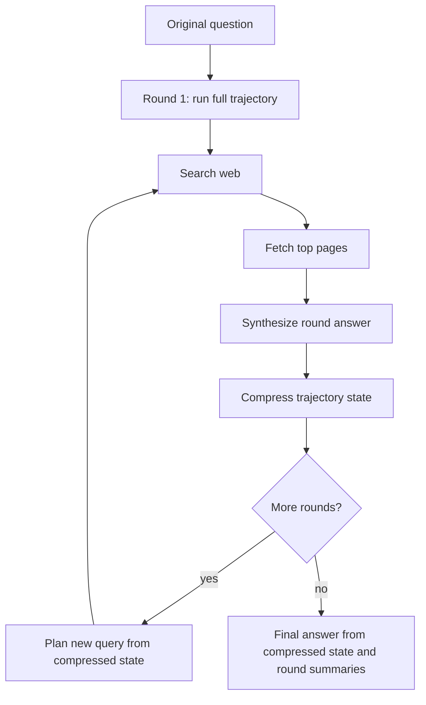
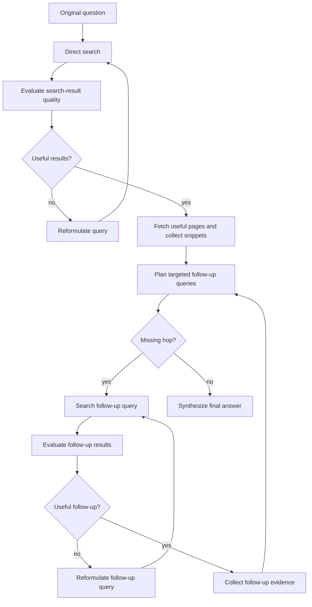

# Agent Pipelines

This document summarizes the two main recovery strategies compared in the
project. The diagrams are written in Mermaid so they render directly on GitHub
and can be copied into slides or reports.

## RE-TRAC-Style Recovery

The restart agent follows a trajectory-compression pattern: it lets a full
search trajectory run, compresses what happened into a structured state, and
starts a new complete trajectory using that compressed state.

The compressed state stores:

- conclusions found so far
- verified evidence
- unresolved uncertainties
- failed search directions
- future search plan
- candidate answer

This design can recover from weak initial searches, but it pays for whole new
rollouts. In the latest 30-question HotpotQA hard bridge run, this agent used
an average of 19.3 steps and 7.3 fetched pages per question.

## Mid-Trajectory Query Reformulation

The reformulation agent intervenes earlier. It evaluates search results before
spending effort on irrelevant pages. If results are weak, it rewrites the query
immediately; if evidence is partially useful, it plans targeted follow-up
queries for the missing hops.

This design is intended to be more efficient because it fixes bad directions
before committing to a full trajectory. In the latest 30-question HotpotQA hard
bridge run, it improved accuracy from 17/30 to 20/30 while reducing average
steps from 19.3 to 10.2 and fetched pages from 7.3 to 3.1.

## Head-To-Head Summary

Latest clean HotpotQA hard bridge result, using 30 questions with seed 42:

| Agent | Accuracy | Tool Errors | Avg Time | Avg Steps | Avg Pages |
| --- | ---: | ---: | ---: | ---: | ---: |
| RE-TRAC-style recovery | 17/30 | 0/30 | 55.0s | 19.3 | 7.3 |
| Mid-trajectory reformulation | 20/30 | 0/30 | 27.1s | 10.2 | 3.1 |

Pairwise comparison:

| Comparable Questions | RE-TRAC Only Correct | Reformulation Only Correct | Both Correct | Both Wrong |
| ---: | ---: | ---: | ---: | ---: |
| 30 | 2 | 5 | 15 | 8 |

## Presentation Framing

The key project claim is not just that reformulation sometimes improves
accuracy. The stronger claim is that mid-trajectory correction can recover from
bad search directions without paying the cost of a complete restart.

In short:

> RE-TRAC-style recovery asks, "How do we restart after a trajectory went
> wrong?" This project asks, "Can we notice the trajectory going wrong earlier
> and repair the query before wasting work?"

